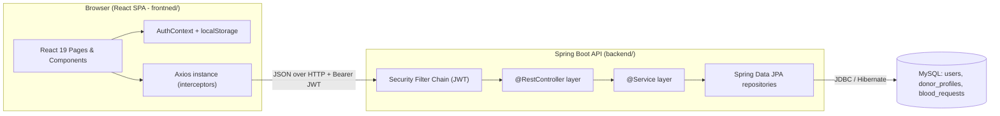
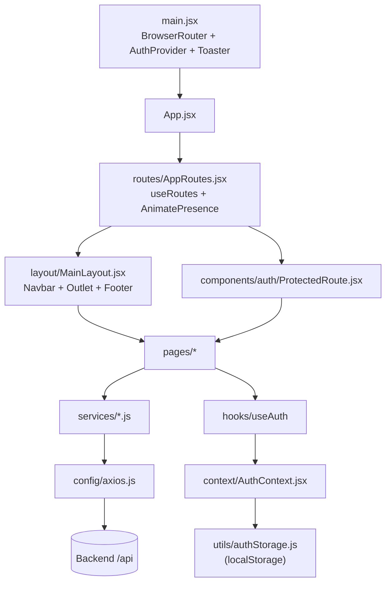
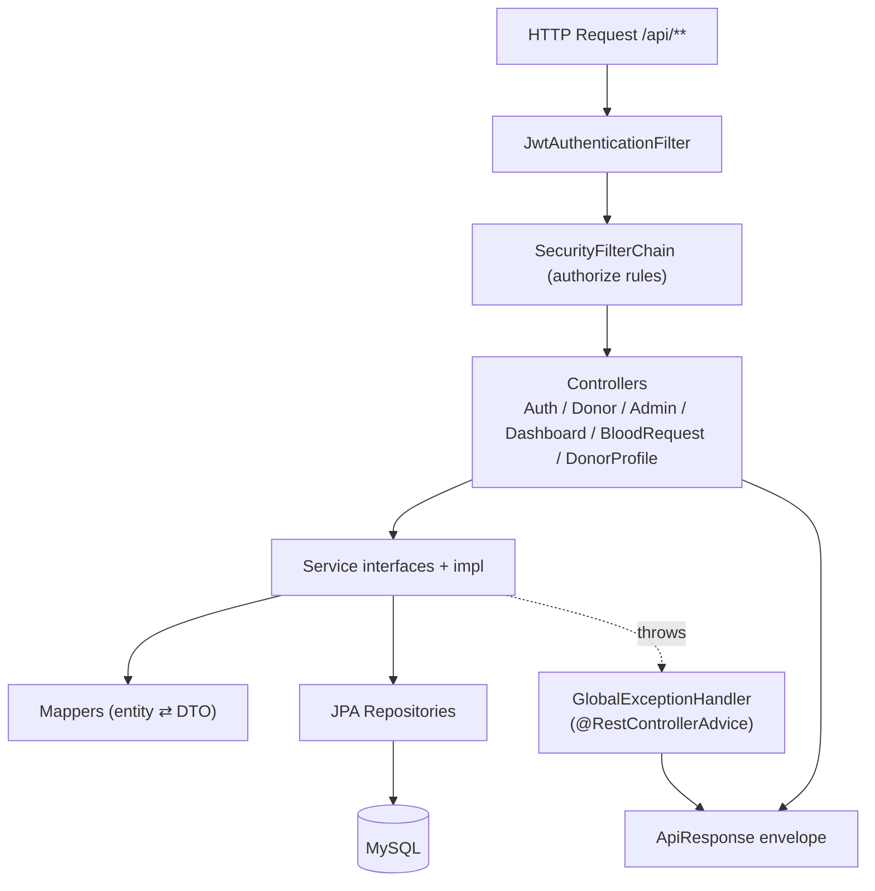
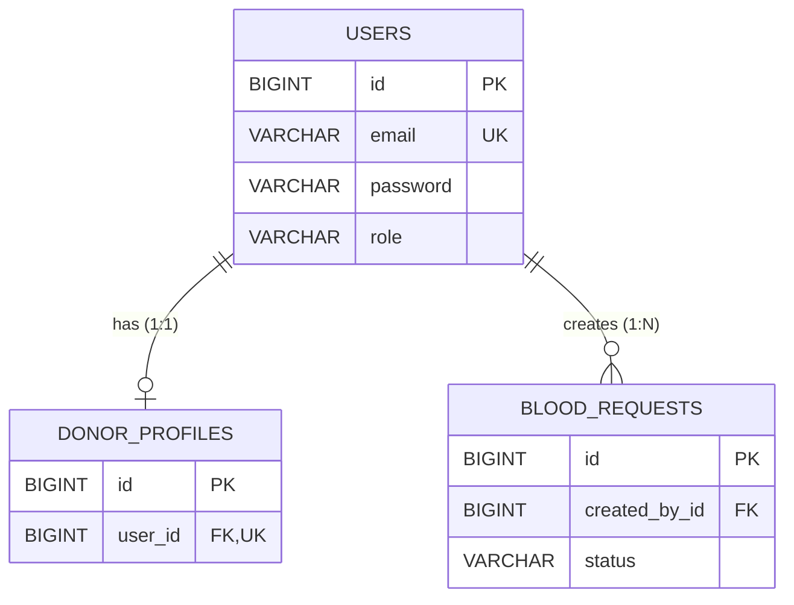
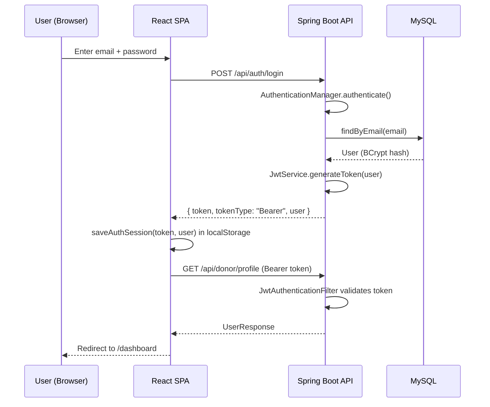
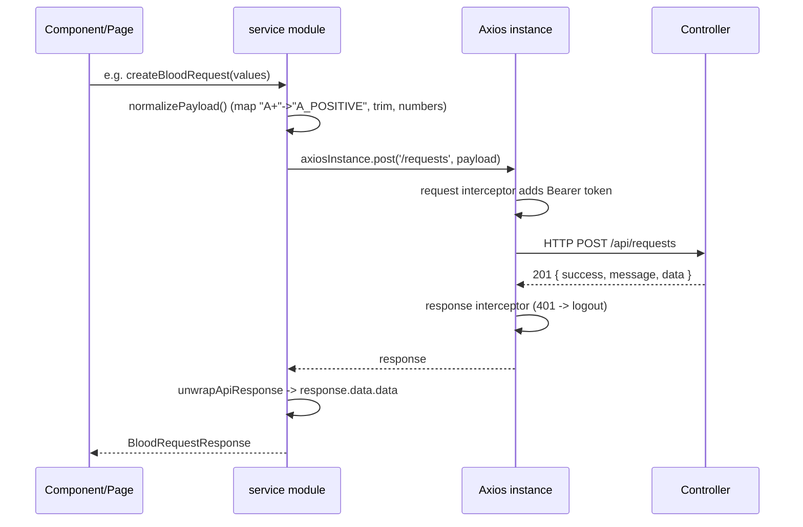
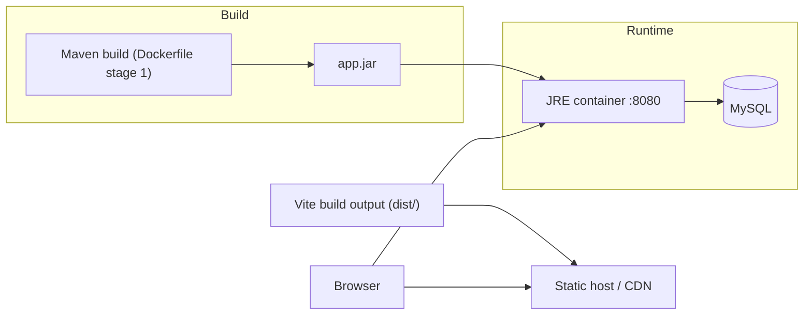

# System Architecture

## High-Level Architecture

BloodBridge is a classic **decoupled SPA + REST API** application. A React single-page app (built with
Vite) talks to a stateless Spring Boot REST API over HTTP/JSON. The API persists data in MySQL and
authenticates requests with JWTs. There is no server-side session store.

- **Base URLs:** the frontend defaults to `http://localhost:8080/api` (`config/environment.js`), and the
  backend serves on port `8080` (`application.properties`). Every backend controller is mapped under
  `/api/...`.
- **Statelessness:** `SecurityConfig` sets `SessionCreationPolicy.STATELESS` and disables CSRF, so all
  authenticated calls must carry `Authorization: Bearer <token>`.

## Frontend Architecture

The frontend is a component-driven React SPA organized by responsibility. See [`FRONTEND.md`](./FRONTEND.md)
for a file-by-file breakdown.

Key architectural choices:

- **Global auth state** lives in `AuthContext`, consumed through the `useAuth()` hook. The token and the
  cached user object are persisted in `localStorage` (`utils/authStorage.js`).
- **Centralized HTTP** through a single Axios instance (`config/axios.js`) with a request interceptor that
  attaches the bearer token and a response interceptor that logs the user out on `401`.
- **Service modules** (`services/*.js`) wrap Axios calls, unwrap the standard `ApiResponse` envelope, map
  UI-friendly values (e.g. `"A+"` ⇄ `"A_POSITIVE"`), and normalize errors.
- **Route protection** via the `ProtectedRoute` wrapper, which redirects unauthenticated users to
  `/login`.

## Backend Architecture

The backend follows a conventional **layered (controller → service → repository) architecture** with
DTOs and mappers isolating the persistence model from the API contract. See [`BACKEND.md`](./BACKEND.md).

Packages (under `com.bloodbridge`):

| Package | Responsibility |
| --- | --- |
| `config` | `SecurityConfig` — filter chain, CORS, password encoder, auth provider |
| `constants` | Enums: `BloodGroup`, `Gender`, `Role`, `RequestStatus`, `Urgency` |
| `controller` | REST endpoints |
| `dto/request`, `dto/response` | Request and response payloads (incl. `ApiResponse<T>`) |
| `entity` | JPA entities: `User`, `DonorProfile`, `BloodRequest` |
| `exception` | Custom exceptions + `GlobalExceptionHandler` |
| `jwt` | `JwtService`, `JwtAuthenticationFilter`, `JwtAuthenticationEntryPoint` |
| `mapper` | Entity ⇄ DTO mapping (`UserMapper`, `DonorProfileMapper`, `BloodRequestMapper`) |
| `repository` | Spring Data JPA repositories |
| `security` | `ApplicationUserDetailsService` (loads users by email) |
| `service` / `service/impl` | Business logic |
| `util` | `SecurityUtils` (reads the authenticated username from the security context) |

## Database Architecture

Three tables, managed by Hibernate with `spring.jpa.hibernate.ddl-auto=update` (configurable). Enums are
persisted as `VARCHAR` via `@Enumerated(EnumType.STRING)`. See [`DATABASE.md`](./DATABASE.md) for the full
ER diagram and column details.

- `User` implements `UserDetails`, so it doubles as the Spring Security principal.
- `DonorProfile` has a unique `user_id` (one profile per user).
- `BloodRequest.createdBy` is a lazy `@ManyToOne` to `User`.
- Auditing: `User` and `BloodRequest` use `@CreatedDate` / `@LastModifiedDate` enabled by
  `@EnableJpaAuditing` on the application class.

## Authentication Flow

Login validates credentials with the `AuthenticationManager`, then issues a JWT. Subsequent requests are
authenticated by `JwtAuthenticationFilter` which populates the `SecurityContext`.

## API Communication Flow

Every response is wrapped in a uniform `ApiResponse<T>` envelope. The frontend unwraps `response.data.data`
and surfaces field-level validation errors from `response.data.errors`.

## Deployment Architecture

The repository contains deployment tooling for the backend only:

- **`backend/Dockerfile`** — a multi-stage build: stage 1 uses `maven:3.9.8-eclipse-temurin-21` to run
  `mvn clean package -DskipTests`; stage 2 uses `eclipse-temurin:21-jre` to run the resulting fat JAR.
  The container exposes port `8080`.
- **Environment-driven configuration** — the backend reads `DB_URL`, `DB_USERNAME`, `DB_PASSWORD`,
  `JWT_SECRET`, `JWT_EXPIRATION_MS`, `CORS_ALLOWED_ORIGINS`, `DDL_AUTO`, and `SHOW_SQL` from environment
  variables (with local-development defaults).

There is **no Dockerfile or CI/CD pipeline for the frontend** in the repository. The frontend is a standard
Vite app: `npm run build` produces a static `dist/` bundle that can be served by any static host, with
`VITE_API_BASE_URL` pointing at the deployed API. See [`SETUP.md`](./SETUP.md) for details and
[`FUTURE_IMPROVEMENTS.md`](./FUTURE_IMPROVEMENTS.md) for deployment gaps.
