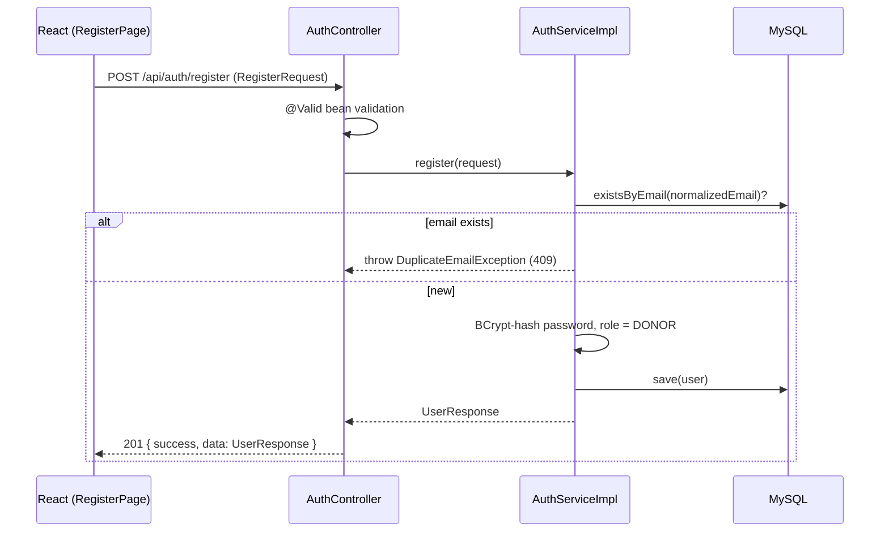
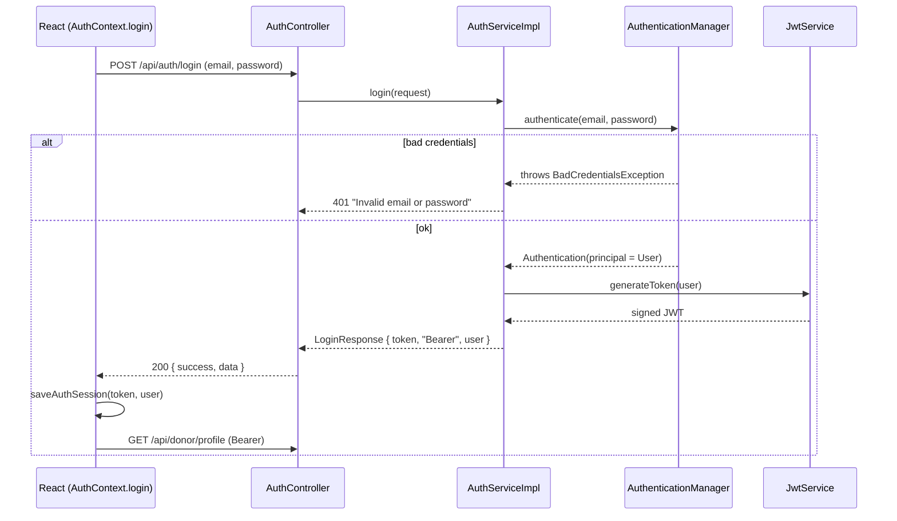
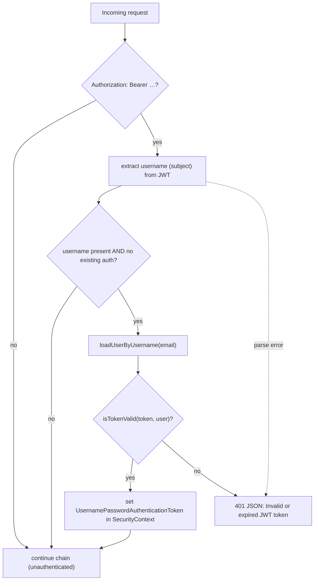

# Authentication & Authorization

BloodBridge uses **stateless JWT authentication** with Spring Security 6 on the backend and a React
`AuthContext` + Axios interceptors on the frontend.

## Overview

- No server-side sessions — `SessionCreationPolicy.STATELESS`, CSRF disabled.
- Login returns a signed JWT; the client stores it and sends it as
  `Authorization: Bearer <token>` on every protected request.
- The JWT subject is the user's **email** (which is also the Spring Security username).
- Authorities are role-based: `ROLE_ADMIN` or `ROLE_DONOR`.

Relevant backend classes:

| Class | Role |
| --- | --- |
| `jwt/JwtService` | Generate/parse/validate tokens |
| `jwt/JwtAuthenticationFilter` | Per-request filter that authenticates the bearer token |
| `jwt/JwtAuthenticationEntryPoint` | Returns JSON `401` for unauthenticated access |
| `security/ApplicationUserDetailsService` | Loads a `User` by email |
| `config/SecurityConfig` | Filter chain, authorization rules, beans |
| `util/SecurityUtils` | Reads the current username from the security context |
| `service/impl/AuthServiceImpl` | Registration + login business logic |

## Registration Flow



Key facts:

- Email is normalized to lowercase before the duplicate check and save.
- The password is hashed with `BCryptPasswordEncoder`.
- The role is **always `DONOR`** — the client cannot self-assign `ADMIN`. (The `RegisterPage` UI shows a
  role selector, but the value is not accepted by `RegisterRequest`.)
- Registration does **not** log the user in; the frontend sends the user to the login page afterward.

## Login Flow



On the client, `AuthContext.login()` stores the token + user in `localStorage`
(`bloodbridge-auth-token`, `bloodbridge-auth-user`) and then re-fetches the profile to refresh state.

## JWT Implementation

`JwtService` (uses `io.jsonwebtoken` / jjwt 0.12.6):

- **Signing key** — derived from `application.security.jwt.secret`. The secret is decoded as Base64 if
  possible; otherwise its raw UTF-8 bytes are used (HMAC-SHA).
- **Claims** — `subject` = username (email); `issuedAt` = now; `expiration` = now +
  `application.security.jwt.expiration-ms` (default `86400000` ms = 24h).
- **Generation** — `generateToken(userDetails)` builds and signs the compact token.
- **Parsing/validation** — extracts the subject and expiration; `isTokenValid(token, userDetails)` checks
  the subject matches and the token is not expired. Signature/format errors throw and are handled by the
  filter.

Login response shape:

```json
{ "token": "eyJ...", "tokenType": "Bearer", "user": { "id": 1, "email": "…", "role": "DONOR" } }
```

## Per-Request Authentication

`JwtAuthenticationFilter` (a `OncePerRequestFilter` registered before
`UsernamePasswordAuthenticationFilter`):



- If no bearer token is present, the request proceeds unauthenticated; protected routes are then rejected
  by `JwtAuthenticationEntryPoint` with `401` and message `"Unauthorized request"`.
- If a token is present but malformed/expired, or the user no longer exists, the filter writes a `401`
  JSON body (`"Invalid or expired JWT token"`) and stops the chain.

## Protected Routes

### Backend (URL authorization)

From `SecurityConfig` (evaluated top-to-bottom):

| Rule | Access |
| --- | --- |
| `OPTIONS /**` | Public (CORS preflight) |
| `/api/auth/**` | Public |
| `GET /api/requests/feed`, `GET /api/requests/active` | Public |
| `/api/admin/**` | `hasRole("ADMIN")` |
| `/api/donor/**` | `hasRole("DONOR")` |
| `anyRequest()` | `authenticated()` |

`@EnableMethodSecurity` is turned on, but no method-level `@PreAuthorize` annotations are used; all
authorization is URL-based plus ownership checks in the service layer.

### Frontend (route guarding)

`components/auth/ProtectedRoute.jsx` wraps protected pages. While `AuthContext` is still initializing it
renders a `LoadingSkeleton`; once resolved, unauthenticated users are redirected to `/login` (with the
attempted location saved in router state). Protected pages: dashboard, profile, profile edit, and all
`/requests` CRUD pages. See [`FRONTEND.md`](./FRONTEND.md#routing) for the full list.

The Axios response interceptor (`config/axios.js`) also logs the user out on any `401` from a non-auth
endpoint, keeping the client state consistent with the server.

## User Roles

- **`DONOR`** — assigned to every registered user. Can manage their own profile, dashboard, and blood
  requests, and read the public feed.
- **`ADMIN`** — can additionally call `/api/admin/**` (currently just `GET /api/admin/users`).

There is **no API to grant the `ADMIN` role**. To create an admin, update the database directly, e.g.:

```sql
UPDATE users SET role = 'ADMIN' WHERE email = 'admin@example.com';
```

There is no admin UI/route in the frontend; admin endpoints must be called directly (e.g. via curl) with an
admin's JWT.

## Security Best Practices Implemented

- Passwords hashed with BCrypt; never returned in any response.
- Stateless JWT auth (no session fixation surface); CSRF disabled appropriately for a token API.
- Server-side authorization (URL rules) plus **ownership checks** (`findByIdAndCreatedBy`) so users cannot
  access other users' requests.
- Server ignores client-supplied role on registration (privilege-escalation guard).
- Bean-validation on all inbound DTOs.
- CORS restricted to a configurable allow-list.

See [`SECURITY.md`](./SECURITY.md) for the full security posture, including the **committed default
secrets** that must be overridden in production.
