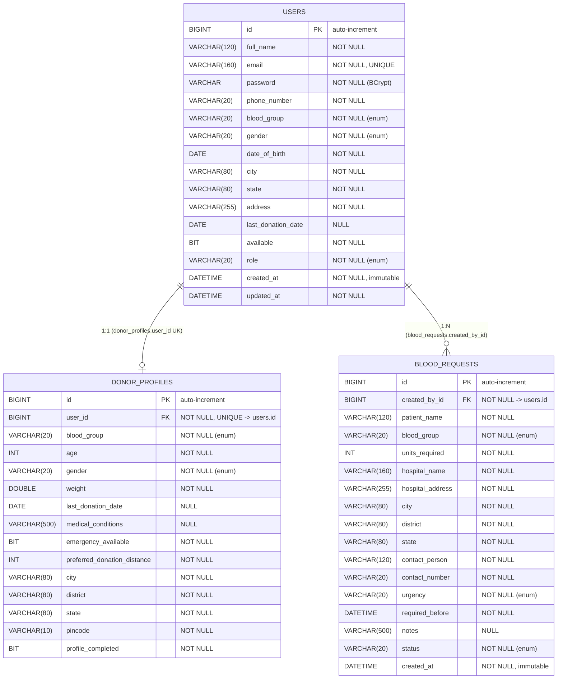

# Database Documentation

BloodBridge uses **MySQL** with Hibernate/JPA. The schema is generated by Hibernate from the JPA entities
(`spring.jpa.hibernate.ddl-auto=update` by default), so there are **no SQL migration files** in the
repository. All enums are stored as `VARCHAR(20)` via `@Enumerated(EnumType.STRING)`.

Default database name: `bloodbridge` (auto-created via `createDatabaseIfNotExist=true` in the JDBC URL).

Three tables: `users`, `donor_profiles`, `blood_requests`.

## ER Diagram

> Column names above use the physical snake_case names Hibernate produces from the camelCase Java fields
> with MySQL's default naming strategy. The exact SQL types depend on the MySQL dialect
> (`org.hibernate.dialect.MySQLDialect`); `boolean` maps to `BIT`/`TINYINT`.

## Relationships

| Relationship | Type | Mapping | Cardinality |
| --- | --- | --- | --- |
| `User` → `DonorProfile` | `@OneToOne(fetch = LAZY, optional = false)` on `DonorProfile.user` | FK `donor_profiles.user_id` (unique) | One user has at most one donor profile |
| `User` → `BloodRequest` | `@ManyToOne(fetch = LAZY, optional = false)` on `BloodRequest.createdBy` | FK `blood_requests.created_by_id` | One user creates many requests |

Both relationships are **lazy-loaded**, and `spring.jpa.open-in-view=false` is set, so associations must be
fetched inside the service/transaction (the mappers read `createdBy` while the entity is still managed).

## Table: `users`

- **Primary key:** `id` (`BIGINT`, `GenerationType.IDENTITY` → auto-increment).
- **Unique constraints:** `email`.
- **Not-null:** all columns except `last_donation_date`.
- **Enums:** `blood_group` (`BloodGroup`), `gender` (`Gender`), `role` (`Role`).
- **Auditing:** `created_at` (immutable, `@CreatedDate`), `updated_at` (`@LastModifiedDate`).
- **Security note:** `password` stores a BCrypt hash and is **never** returned by the API (`UserResponse`
  omits it).

## Table: `donor_profiles`

- **Primary key:** `id`.
- **Foreign key:** `user_id` → `users.id`, `NOT NULL`, **UNIQUE** (enforces 1:1).
- **Not-null:** all columns except `last_donation_date` and `medical_conditions`.
- **Enums:** `blood_group`, `gender`.
- **Derived flag:** `profile_completed` is set by the mapper (`true` when completion percentage is 100).

## Table: `blood_requests`

- **Primary key:** `id`.
- **Foreign key:** `created_by_id` → `users.id`, `NOT NULL`.
- **Not-null:** all columns except `notes`.
- **Enums:** `blood_group`, `urgency` (`Urgency`), `status` (`RequestStatus`).
- **Auditing:** `created_at` (immutable, `@CreatedDate`). There is no `updated_at` on this table.
- **Default status:** `PENDING` on creation (set by `BloodRequestMapper`).

## Enum Reference

| Enum | Values | Stored as |
| --- | --- | --- |
| `BloodGroup` | `A_POSITIVE`, `A_NEGATIVE`, `B_POSITIVE`, `B_NEGATIVE`, `AB_POSITIVE`, `AB_NEGATIVE`, `O_POSITIVE`, `O_NEGATIVE` | `VARCHAR(20)` |
| `Gender` | `MALE`, `FEMALE`, `OTHER` | `VARCHAR(20)` |
| `Role` | `ADMIN`, `DONOR` | `VARCHAR(20)` |
| `RequestStatus` | `PENDING`, `ACTIVE`, `FULFILLED`, `CANCELLED` | `VARCHAR(20)` |
| `Urgency` | `LOW`, `MEDIUM`, `HIGH`, `CRITICAL` | `VARCHAR(20)` |

## Schema Management & Indexing

- **DDL strategy:** `ddl-auto=update` (overridable via `DDL_AUTO`). This is convenient for development but
  should be set to `validate` (with managed migrations) in production — see
  [`FUTURE_IMPROVEMENTS.md`](./FUTURE_IMPROVEMENTS.md).
- **Indexes:** only those implied by the PK and unique constraints (`users.email`,
  `donor_profiles.user_id`) plus the FK indexes MySQL creates automatically. No custom indexes are defined
  in the entities (e.g. no explicit index on `blood_requests.status` or `city`, which back the feed query).
- **Pagination:** repository finder methods return `List<...>` with no `Pageable`, so list/feed endpoints
  return all matching rows.
